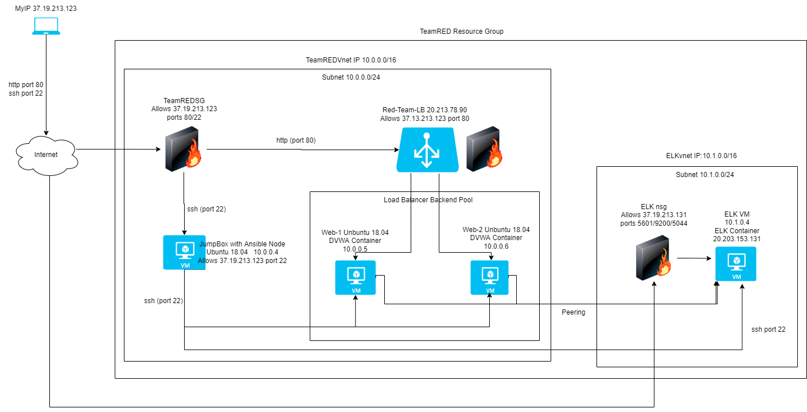
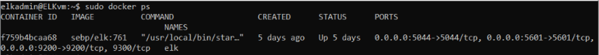

# ELK-Stack

## Automated ELK Stack Deployment

The files in this repository were used to configure the network depicted below.

These files have been tested and used to generate a live ELK deployment on Azure. They can be used to either recreate the entire deployment pictured above. Alternatively, select portions of the ___playbook___ file may be used to install only certain pieces of it, such as Filebeat.

[Docker Install](Ansible/pentest.yml)

[Hosts](Ansible/hosts)

[Elk Install](Ansible/install-EKL.yml)

[Filebeat Install](Ansible/filebeat-playbook.yml)

[Filebeat Config](Ansible/filebeat-config.yml)

[Metricbeat Install](Ansible/metricbeat-playbook.yml)

[Metricbeat Config](Ansible/metricbeat-config.yml)

This document contains the following details:
- Description of the Topology
- Access Policies
- ELK Configuration
  - Beats in Use
  - Machines Being Monitored
- How to Use the Ansible Build

### Description of the Topology

The main purpose of this network is to expose a load-balanced and monitored instance of DVWA, the D*mn Vulnerable Web Application.

Load balancing ensures that the application will be highly __available__, in addition to restricting __access__ to the network.
- Load balancers protect the availability of the application server, allowing traffic to be diverted to a secondary server in order to maintain a manageable amout of traffic per server.  The advantage of a jump box is that you can access the cloud setup from the backend via secured entry to manage/troubleshoot/configure/etc

Integrating an ELK server allows users to easily monitor the vulnerable VMs for changes to the __log files___ and system __health___.
- Filebeat monitors log file changes
- Metricbeat monitors system parameters and health

The configuration details of each machine may be found below.

| Name     | Function | IP Address               | Operating System |
|----------|----------|--------------------------|------------------|
| Jump Box | Gateway  | 10.0.0.4, 20.213.88.91   | Linux            |
| Web-1    | Server   | 10.0.0.5                 | Linux            |
| Web-2    | Server   | 10.0.0.6                 | Linux            |
| ELW      | Server   | 10.1.0.4, 20.203.153.131 | Linux            |

### Access Policies

The machines on the internal network are not exposed to the public Internet. 

Only the __load balancer__ machine can accept connections from the Internet. Access to this machine is only allowed from the following IP addresses:
- 37.19.213.123 (my computer's public IP address)

Machines within the network can only be accessed by __the jump box___.
- ELK vm accessible from the jump box(10.0.0.4) or Public Internet, which is only accessible from my public IP address 37.19.213.123

A summary of the access policies in place can be found in the table below.

| Name     | Publicly Accessible | Allowed IP Addresses    |
|----------|---------------------|-------------------------|
| Jump Box | Yes, but restricted | 37.19.213.123           |
| Web-1    | No                  | 10.0.0.4                |
| Web-2    | No                  | 10.0.0.4                |
| ELK      | Yes, but restricted | 10.0.0.4, 37.19.213.123 |
| L-Bal    | Yes                 | 37.19.213.123           |

### Elk Configuration

Ansible was used to automate configuration of the ELK machine. No configuration was performed manually, which is advantageous because...
- We can configure/deploy software/update multiple machines with one automated playbook

The playbook implements the following tasks:
- download software/docker
- install software/docker
- configure software
- launch the newly downloaded software/start docker service
- configure the software to launch on boot/enable docker at boot

The following screenshot displays the result of running `docker ps` after successfully configuring the ELK instance.

### Target Machines & Beats
This ELK server is configured to monitor the following machines:
- 10.0.0.5
- 10.0.0.6

We have installed the following Beats on these machines:
- filebeats
- metricbeats

These Beats allow us to collect the following information from each machine:
- _TODO: In 1-2 sentences, explain what kind of data each beat collects, and provide 1 example of what you expect to see. E.g., `Winlogbeat` collects Windows logs, which we use to track user logon events, etc._
- filebeats tracks log changes (ie:               )
- metricbeats monitors system parameters/health/load/resource usage  (ie:                        )

### Using the Playbook
In order to use the playbook, you will need to have an Ansible control node already configured. Assuming you have such a control node provisioned: 

SSH into the control node and follow the steps below:
- Copy the __yml__ file to __Ansible__.
- Update the __hosts__ file to include the target machines
- Run the playbook, and navigate to __https://ELKip:5601/app/kibana__ to check that the installation worked as expected.

- _Which file is the playbook? Where do you copy it?_The *.yml files are playbooks, copy to the Ansible directories
- _Which file do you update to make Ansible run the playbook on a specific machine? How do I specify which machine to install the ELK server on versus which to install Filebeat on? edit hosts file(defines webservers vs. ELK vs. others)
- _Which URL do you navigate to in order to check that the ELK server is running?  http://ELK.IP:5601/app/kibana

_As a **Bonus**, provide the specific commands the user will need to run to download the playbook, update the files, etc._
